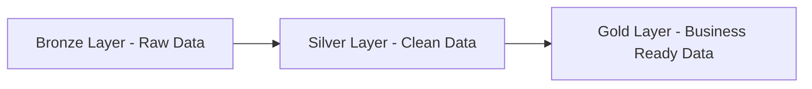

<p align="center">
  
</p>

<p align="center">


</p>

# 📊 End-to-End Data Warehouse Project

### 🥉 Bronze → 🥈 Silver → 🥇 Gold Architecture

---

## 🚀 Project Summary

This project demonstrates the implementation of a **modern data warehouse pipeline** using the **Medallion Architecture (Bronze, Silver, Gold layers)**.

The solution processes raw CRM and ERP data, transforms it into clean and structured datasets, and builds a **business-ready analytical model** for reporting and insights.

---

## 🏗️ Architecture



---

## 🥉 Bronze Layer – Raw Data

📌 Stores raw, unprocessed data directly from source systems
📂 Tables:

* crm_cust_info
* crm_prd_info
* crm_sales_details
* erp_loc_a101
* erp_cust_az12
* erp_px_cat_g1v2

⚙️ Key Features:

* Original data preserved
* Minimal validation
* Supports traceability

---

## 🥈 Silver Layer – Cleaned & Transformed Data

📌 Data cleaning, transformation, and standardization

🔄 Transformations Applied:

* Removed duplicates using `ROW_NUMBER()`
* Trimmed and standardized text (`TRIM`, `UPPER`)
* Converted raw date formats into `DATE`
* Standardized categorical values
* Handled null and invalid data
* Recalculated incorrect sales values
* Implemented **SCD Type 2** using `LEAD()`

📂 Tables:

* crm_cust_info
* crm_prd_info
* crm_sales_details
* erp_loc_a101
* erp_cust_az12
* erp_px_cat_g1v2

---

## 🥇 Gold Layer – Business Ready Data

📌 Modeled and optimized for analytics and reporting

⭐ Star Schema:

**Dimension Tables**

* dim_customer
* dim_product
* dim_location

**Fact Table**

* fact_sales

📊 Use Cases:

* Sales analysis
* Customer segmentation
* Product insights
* KPI dashboards

---

## 🛠️ Tech Stack

* SQL Server (T-SQL)
* Data Warehousing
* ETL Pipeline
* Power BI

---

## 📁 Project Structure

```bash
project/
│
├── bronze/
│   ├── create_tables.sql
│
├── silver/
│   ├── create_tables.sql
│   ├── transformations.sql
│
├── gold/
│   ├── dim_tables.sql
│   ├── fact_tables.sql
│
├── assets/
│   ├── dashboard.png
│
├── README.md
```

---

## ▶️ How to Run

```sql
CREATE SCHEMA bronze;
CREATE SCHEMA silver;
CREATE SCHEMA gold;
```

1. Run Bronze scripts
2. Run Silver scripts
3. Run Gold scripts

---

## 📊 Dashboard Preview

<p align="center">
  
</p>

---

## 🔮 Future Improvements

* Incremental loading
* Performance optimization
* Cloud deployment (Azure/AWS)
* Real-time pipelines

---

## 👨‍💻 Author

**Pritesh Raj**
Aspiring Data Analyst / Data Engineer

---

## ⭐ Support

If you like this project:

* ⭐ Star the repo
* 🍴 Fork it
* 🤝 Contribute

---

<p align="center">
  
</p>
